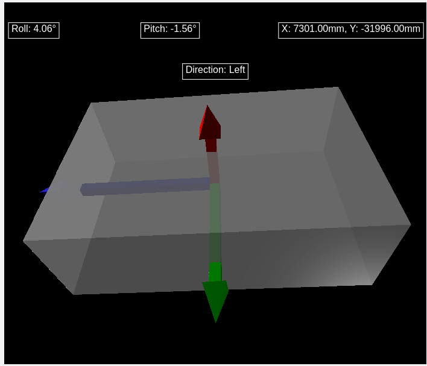
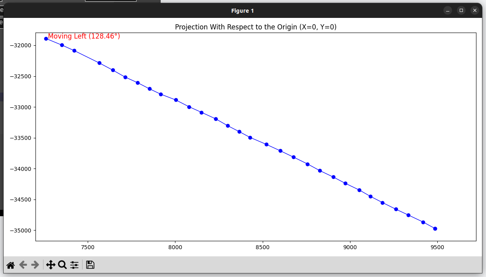

# GNSS Data Processing
This project receives a file with data in the following format:

- `time_s, x_mm, y_mm, roll_deg, pitch_deg`

One entry at per line. For instance:

```
1621693264.0155628, 9521, -35074, 3.92, -1.35
1621693264.1979840, 9450, -34970, 3.93, -1.22
1621693264.4237902, 9365, -34853, 3.85, -1.24
...
```
The file `gnss_data.txt` contains a sample data that is used in the application.

This project shows both 2D and 3D plots of the direction and heading of the GNSS module.

## Installation
To install this application it is advised to create an virtual environment to install and run the python dependencies. You can create a new virtual enviironment for python by running the following command in a terminal (for Linux Operating Systems):

`python3 -m venv GNSS_processing`

After tha, you can activate the environment with:

`source GNSS_processing/bin/activate`

Now you can install all the dependencies used in this project with:

`pip install -r requirements.txt`

## Running
The main file to run this appllication is `GNSS_data_processing.py`. You can  execute this file from whithin the virtual environment with:

`python GNSS_data_processing.py`

This will open a tab  on the default web browser and show the module's: Pitch,  Roll, Current X and Y positions and Direction (Left, Rigthor Forward).
Also, a window for the 2D plot will pop up. Wait until the end of the animatio. Close the 2D plot window, then you  will be able to see the 3D movement with pitch  and roll of the GNSS module.

A sample of the output is shown below:




To exit the application simply close the web browser opened by this script.
